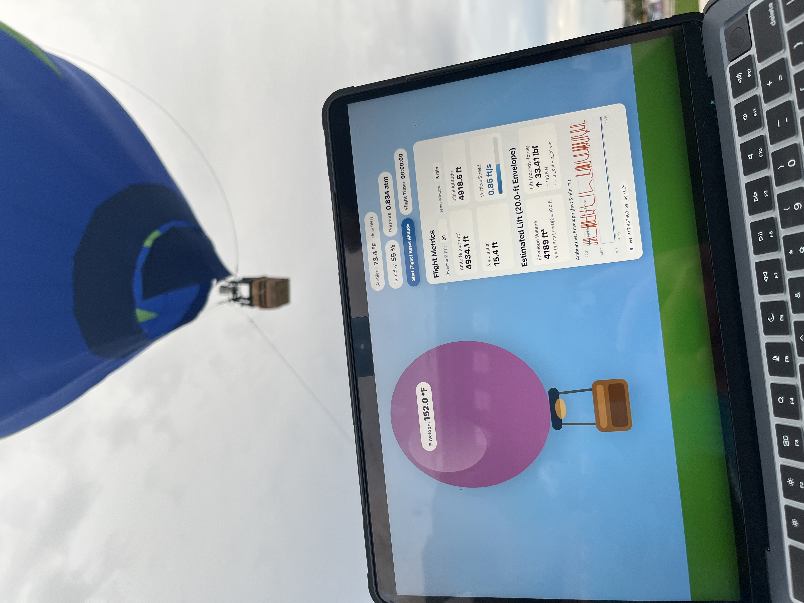

# RC Balloon Telemetry (ESP32)
AP-only telemetry website with JSON endpoint, static OLED status page, a READY LED, and a flight timer/reset control.



---

## What this project does
- **ESP32 hosts its own Wi‑Fi AP** (no STA attempts). Open by default.
- Serves a **full telemetry website** at `/` and **JSON** at `/data.json`.
- Shows a **static status page** on the SSD1306 OLED.
- **READY LED** indicates state (double‑blink at boot, solid when ready; fast blink if envelope temp > 200°F).
- **Flight timer** and “**Reset Initial Altitude**” button on the website.

**Endpoints**
- `GET /` → Telemetry website (includes flight time + reset)
- `GET /data.json` → JSON like:
  ```json
  {
    "envelopeTempF": <float|null>,
    "ambientTempF":  <float|null>,
    "humidityPct":   <float|null>,
    "pressurehPa":   <float|null>,
    "altitudeM":     <float|null>,
    "ambientSource": "DHT|MPL",
    "timestamp":     <millis>
  }
  ```

---

## What’s on the telemetry website (at `/`)
- **Balloon visualization with overlay pill**
  - Shows **Envelope temperature (°F)**.
  - Turns into a **hot blink** animation when envelope > **200°F**.
- **Ambient, Humidity, Pressure badges**
  - **Ambient (°F)** with **source note**: *DHT* preferred, *MPL* fallback.
  - **Humidity (%)** from DHT11.
  - **Pressure (atm)** derived from MPL3115A2 pressure (hPa → atm).
- **Controls row**
  - **Start Flight / Reset Altitude** button: sets the current altitude as the baseline and starts the **flight timer**.
  - **Flight Time** pill shows `HH:MM:SS` since last reset.
- **Flight Metrics card**
  - **Altitude (current)**, **Initial Altitude**, and **Δ vs. Initial** (all in feet).
  - **Vertical Speed (ft/s)** with an animated **progress bar** (up/down color).
  - **Envelope diameter input (ft)** → recomputes **volume** and **lift**.
  - **Estimated Lift** section
    - **Envelope Volume (ft³)** (sphere approx: `V = (4/3)πr³`).
    - **Lift** shown in **lbf** (primary) and **N** (note), using `L = (ρ_out − ρ_in)·V·g` with ambient/envelope temps and pressure.
  - **Temperature history mini‑chart**
    - Ambient vs. Envelope (°F) for a selectable window (2, 5, 10, 15 minutes).
- **Link status chip**
  - Shows **Live / Degraded / Offline** with **round‑trip time** and **data age** while polling `/data.json` once per second.

> The OLED displays a **single static status page** (SSID, IP, and per‑sensor OK boxes) that refreshes roughly once per second.

---

## Hardware & wiring (quick reference)
- **Board**: DOIT ESP32 DEVKIT V1 *(or “ESP32 Dev Module”)*
- **DHT11** → `GPIO19` (DATA) **+ 10k pull‑up** from DATA to **3.3V**
- **I²C** (default): `SDA=GPIO21`, `SCL=GPIO22`  
  - Optional alternate pins: `SDA=GPIO33`, `SCL=GPIO32` by setting `#define USE_ALT_I2C_PINS 1`
- **OLED (SSD1306)**: I²C @ `0x3C` (change to `0x3D` if yours scans there)
- **MPL3115A2 baro/alt**: I²C @ `0x60`
- **MLX90614 IR temp (optional)**: I²C @ `0x5A` or `0x5B` *(manual SMBus reads; no extra lib)*
- **READY LED**: `GPIO23` (series resistor 220–1kΩ to GND; LED anode on GPIO23)

### Wiring table
| Component | Function / Signal | ESP32 Pin / Bus | Notes |
|---|---|---|---|
| **DHT11** | DATA | **GPIO19** | Add **10k pull‑up** from DATA → **3.3V** |
|  | VCC | **3.3V** |  |
|  | GND | **GND** |  |
| **I²C (default)** | SDA | **GPIO21** | Set `USE_ALT_I2C_PINS 0` |
|  | SCL | **GPIO22** |  |
| **I²C (alternate)** | SDA | **GPIO33** | Set `USE_ALT_I2C_PINS 1` |
|  | SCL | **GPIO32** |  |
| **SSD1306 OLED** | SDA | **I²C SDA** | Address **0x3C** (or **0x3D**) |
|  | SCL | **I²C SCL** |  |
|  | VCC | **3.3V** |  |
|  | GND | **GND** |  |
| **MPL3115A2** | SDA | **I²C SDA** | Address **0x60** |
|  | SCL | **I²C SCL** |  |
|  | VCC | **3.3V** |  |
|  | GND | **GND** |  |
| **MLX90614 (opt.)** | SDA | **I²C SDA** | Address **0x5A** or **0x5B** |
|  | SCL | **I²C SCL** |  |
|  | VCC | **3.3V** |  |
|  | GND | **GND** |  |
| **READY LED** | Anode (+) | **GPIO23** | Use **220–1kΩ** series resistor to limit current |
|  | Cathode (−) | **GND** | LED lights when pin is **HIGH** |

> Tip: The sketch includes an **I²C scanner**. Open Serial Monitor at **115200** to see detected device addresses. If SDA/SCL might be bad, switch to the alternate pins and retest.

---

## Arduino IDE setup (DOIT ESP32)
1. **Install Arduino IDE** (2.x recommended).
2. **Add ESP32 board package:**
   - *Arduino IDE → Preferences → Additional Boards Manager URLs* → add the ESP32 package URL.
   - *Tools → Board → Boards Manager* → search **“esp32” (by Espressif Systems)** → **Install**.
3. **Select the board:**
   - *Tools → Board → ESP32* → **DOIT ESP32 DEVKIT V1** *(or “ESP32 Dev Module”)*.
4. **Recommended settings (typical defaults are fine):**
   - Upload speed `921600` (or `115200` if flaky)
   - CPU `240 MHz`, Flash `80 MHz`, Partition `Default`

**First run**
- Open the sketch in Arduino IDE, select the correct **Port**, then **Upload**.
- After upload, open **Serial Monitor @ 115200** to watch boot, I²C scan, and web start logs.

---

## Libraries you need (and how to add them)
These are installed via the **Library Manager** unless noted otherwise.

### Required
- **Adafruit MPL3115A2 Library**
- **Adafruit Unified Sensor** *(dependency for some Adafruit sensor libs)*
- **Adafruit BusIO** *(dependency for Adafruit drivers)*
- **Adafruit GFX Library**
- **Adafruit SSD1306**
- **DHT sensor library** *(by Adafruit)*

> The following are **part of the ESP32 core** and **need no extra install**: `WiFi.h`, `WebServer.h`, `Wire.h`.

### How to install (Library Manager)
- *Arduino IDE → Tools → Manage Libraries…*  
  Search each name above and click **Install**. If prompted, accept installing dependencies.

### Installing from a ZIP (alternative)
- Download the library ZIP from its source.
- *Arduino IDE → Sketch → Include Library → Add .ZIP Library…* → pick the ZIP.  
  The IDE will place it in your libraries folder.

---

## Configure Wi‑Fi AP & options
In `USER CONFIG` near the top of the sketch:
```cpp
#define AP_SSID      "P.R. NM: RC Balloon"
#define AP_PASSWORD  ""   // empty → OPEN AP; set a strong passphrase for WPA2
#define USE_ALT_I2C_PINS 0
```
- Leave `AP_PASSWORD` empty for an **open AP** (easiest in the field), or set a password for WPA2.
- Change `USE_ALT_I2C_PINS` to `1` to try `SDA=33 / SCL=32` if 21/22 are unreliable on your board.
- **OLED address**: adjust `#define OLED_ADDR 0x3C` to `0x3D` if your display is at `0x3D`.

---

## Using the telemetry site
1. **Power** the ESP32. It will start its own AP named **“P.R. NM: RC Balloon”**.
2. Connect a phone/laptop to that AP (password blank if open).
3. Open a browser to **http://192.168.4.1/**  
   - **Main page**: live telemetry, flight timer, “Start Flight / Reset Altitude” button.
   - **JSON** is at **`/data.json`** for tooling or dashboards.
4. The OLED shows a **static status page** with liveness and addresses.

---

## Sensor notes
- **Ambient temp source**: prefers **DHT11**, falls back to **MPL3115A2** temp if DHT isn’t ready.
- **Overheat logic** (MLX object °F): fast LED blink when **≥ 200°F**, solid again when **≤ 195°F**.
- **Sampling periods**: main loop ~**1 Hz**, DHT ~**1.2 s** cadence with retries.
- **Wire clock**: **50 kHz** for robust mixed‑bus wiring (longer leads / breadboards).

---

## Troubleshooting
- **No I²C devices found**: check power, GND, SDA/SCL; try `USE_ALT_I2C_PINS=1`; run the built‑in **I²C scan**.
- **OLED blank**: verify address `0x3C` vs `0x3D` and wiring; keep wires short.
- **DHT11 flaky**: ensure **10k pull‑up** to 3.3V on DATA, and give it a second to warm up.
- **Can’t load website**: confirm you’re connected to the AP; browse to **http://192.168.4.1**; power‑cycle ESP32.
- **Altitude weird**: press **“Start Flight / Reset Altitude”** on the web UI to re‑zero the baseline.

---

## License (MIT)
Copyright (c) 2025 <Your Name Here>

Permission is hereby granted, free of charge, to any person obtaining a copy
of this software and associated documentation files (the “Software”), to deal
in the Software without restriction, including without limitation the rights
to use, copy, modify, merge, publish, distribute, sublicense, and/or sell
copies of the Software, and to permit persons to whom the Software is
furnished to do so, subject to the following conditions:

The above copyright notice and this permission notice shall be included in
all copies or substantial portions of the Software.

THE SOFTWARE IS PROVIDED “AS IS”, WITHOUT WARRANTY OF ANY KIND, EXPRESS OR
IMPLIED, INCLUDING BUT NOT LIMITED TO THE WARRANTIES OF MERCHANTABILITY,
FITNESS FOR A PARTICULAR PURPOSE AND NONINFRINGEMENT. IN NO EVENT SHALL THE
AUTHORS OR COPYRIGHT HOLDERS BE LIABLE FOR ANY CLAIM, DAMAGES OR OTHER
LIABILITY, WHETHER IN AN ACTION OF CONTRACT, TORT OR OTHERWISE, ARISING FROM,
OUT OF OR IN CONNECTION WITH THE SOFTWARE OR THE USE OR OTHER DEALINGS IN
THE SOFTWARE.
